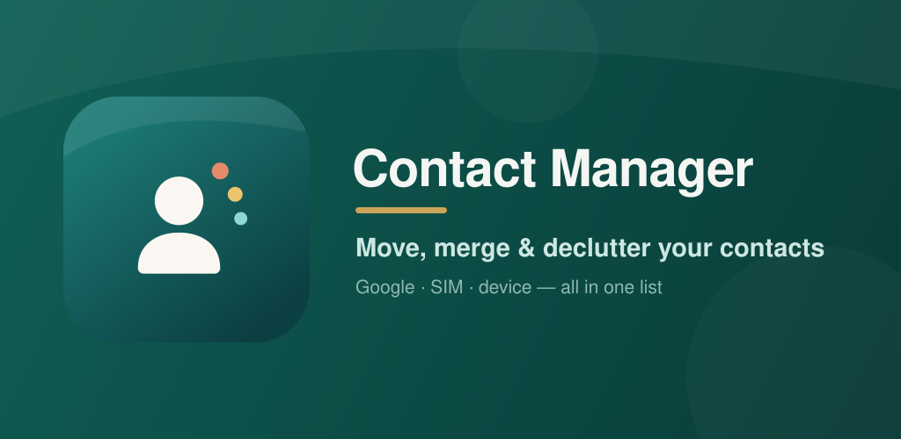
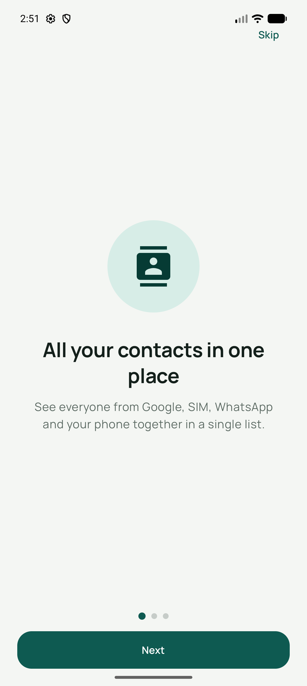
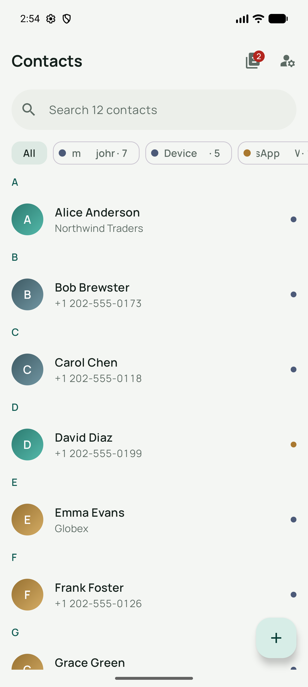
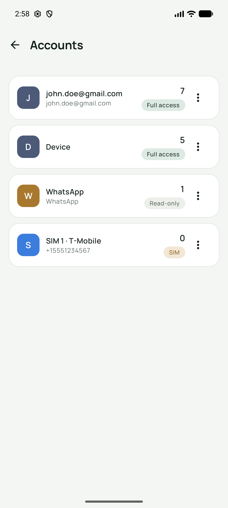
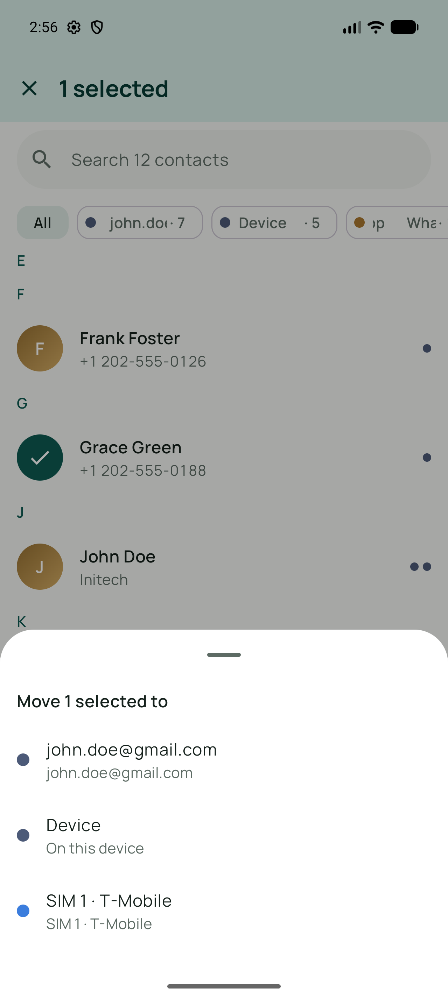

<div align="center">
  

  <h1>ContactManager</h1>

  <p>
    <strong>Every contact source on your device, in one list.</strong><br>
    Google · Samsung · device-local · SIM · WhatsApp / Telegram / Viber / Signal
  </p>

  <p>
    
    
    
    
    
  </p>

  <a href="https://play.google.com/store/apps/details?id=com.ryccoatika.contactmanager">
    
  </a>
</div>

<p align="center">
  
</p>

Android contact manager that surfaces **every** contact source on the device — Google, Samsung, device-local, SIM cards, and app-managed accounts like WhatsApp or Telegram — in one unified list, and lets you organize contacts across them. It talks directly to `ContactsContract`: no cache database, no backend, contacts never leave the device.

## Screenshots

<p align="center">
  
  
  
  
</p>

<p align="center"><em>Onboarding · Unified list · Accounts · Move &amp; copy</em></p>

## Features

- **Unified contact list** across all signed-in accounts, with per-account filter chips, colored account badges, search (name / phone / email), sticky letter headers, and an alphabet fast-scroll rail.
- **Per-account CRUD**: create, edit, and delete contacts in any writable account. App-managed accounts (WhatsApp, Telegram, Viber, Signal, …) are shown **read-only** — those apps derive their contact entries themselves; writing into them is ignored or clobbered by their sync.
- **Move & copy between accounts**: single contacts or multi-selected batches. Copy-then-delete ordering — a mid-flight failure can leave a duplicate, never lose data. Field-loss warnings before lossy moves (e.g. to SIM).
- **Full SIM support**: read, create, edit, delete, and move contacts on SIM — via the vendor account (Samsung) or the `icc/adn` provider elsewhere, with dual-SIM labels, a write-capability probe, and SIM field limits enforced in the editor (name length, single number).
- **Duplicate management**: indexed matching on normalized phones (country-code tolerant), emails, and diacritic/token-folded names. Per group: **Link** (reversible, native aggregation), **Merge** into a chosen account (destructive, confirmed), or **Not duplicate** (persisted dismissal).
- **"Porcelain & Pine" design system**: a premium Material 3 identity — pine-teal signature on a green-biased porcelain neutral, Manrope type, gradient identity avatars, grouped cards, brass accent, and shimmer loading states. Both light and dark are designed first-class. Dynamic color (Monet) is opt-in on Android 12+. See `docs/superpowers/specs/2026-07-30-premium-redesign-design.md`.

## Architecture

MVVM + Repository, directly over `ContactsContract` — **no cache database**. The provider is already a local SQLite store with change notifications; mirroring it would only add sync bugs.

```
ui/        Compose screens + ViewModels (Hilt, Navigation-Compose)
domain/    Pure logic: AccountClassifier, MovePlanner, DuplicateFinder, SimContactValidator
data/      Repositories over ContactsContract + icc/adn; batch ops; DataStore prefs
data/sim/  SIM sources, capability probe/cache, subscriptions, pseudo-account merge
di/        Hilt modules (dispatchers, app scope, bindings)
```

Key decisions:

- **All provider I/O on `Dispatchers.IO` inside repositories** — main-thread safety is enforced at the source, never trusted to callers.
- **One bulk `Data`-table query** grouped in memory into contact aggregates — no per-contact cursor loops; smooth at 5000+ contacts.
- Live updates via `ContentObserver` → debounced re-query `Flow`.
- Writes via `applyBatch` chunked ≤400 ops (binder transaction limit), every operation caught into a typed `ContactOpResult` — provider errors surface as snackbars, never crashes.
- `SimAwareContactsWriter` decorator routes CRUD between `ContactsContract` and the `icc/adn` provider transparently.
- Long batch moves run in an application-scoped coroutine (survive rotation), with cancellable progress.
- Pure domain logic (matching, planning, validation, classification) is JVM-unit-tested, and the suite is a merge gate in CI.

## Package map

| Package | Responsibility |
|---|---|
| `domain/model` | Value types: `Contact`, `RawContact`, `ContactAccount`, `SimContact`, capabilities |
| `domain` | `AccountClassifier`, `MovePlanner` (+field-loss), `DuplicateFinder`, `SimContactValidator` |
| `data` | `ContactsRepository` (read flow), `ContactsWriteRepository` (CRUD/link/merge), `SimAwareContactsWriter`, `AccountRepository`, `BatchOperationManager`, `DuplicatePrefs` |
| `data/sim` | `IccSimSource`, `SimRepository` + capability cache, `SimSubscriptions`, `SimAccountsIntegration` |
| `ui/home` | Unified list, filters, search, multi-select (move/delete/merge), batch progress |
| `ui/detail` | Per-account sections, edit/delete/move, read-only locks |
| `ui/editor` | Create/edit with account picker; SIM-limited form |
| `ui/accounts` | Account list with capability tags, move-all, SIM re-probe pull-to-refresh |
| `ui/duplicates` | Match groups: link / merge / dismiss |

## Build & run

```bash
./gradlew :app:assembleDebug          # build
./gradlew :app:testDebugUnitTest      # JVM unit tests
./gradlew :app:lintDebug              # lint
```

Requires JDK 17+, Android SDK 36. minSdk 24 (Android 7.0), targetSdk 36.

Permissions: `READ_CONTACTS`/`WRITE_CONTACTS` (gated at launch with rationale + settings deep-link), `READ_PHONE_STATE` (optional, requested lazily — only used to label dual-SIM subscriptions).

## Device-compatibility caveats

- **`icc/adn` provider varies across OEMs**: some return no result URI on success, expose `_id`/`index` inconsistently, or throw undocumented exceptions. Reads tolerate missing columns; every call is wrapped. Updates match on old name+number and can fail if the SIM holds exact duplicates.
- **Samsung devices** expose SIM contacts as a `vnd.sec.contact.sim` account inside `ContactsContract`; the app detects this and skips the `icc/adn` pseudo-account to avoid double listing.
- **Capability probe** (read + reversible test-write) is cached in DataStore; after a SIM swap the cache may be stale — pull-to-refresh on the Accounts screen re-probes.
- **SIM-full detection**: no reliable API; inserts that fail on a full SIM surface the provider's generic rejection ("it may be full or read-only").
- **App-managed accounts** (WhatsApp etc.) cannot be written or deleted from third-party apps by design; they participate in duplicate detection and can be linked, and merges copy their data and link instead of deleting.
- If the probe's insert succeeds but its cleanup delete fails (rare), a `zzcmprobe/000` marker entry can remain on the SIM; the SIM is then reported read-only.
